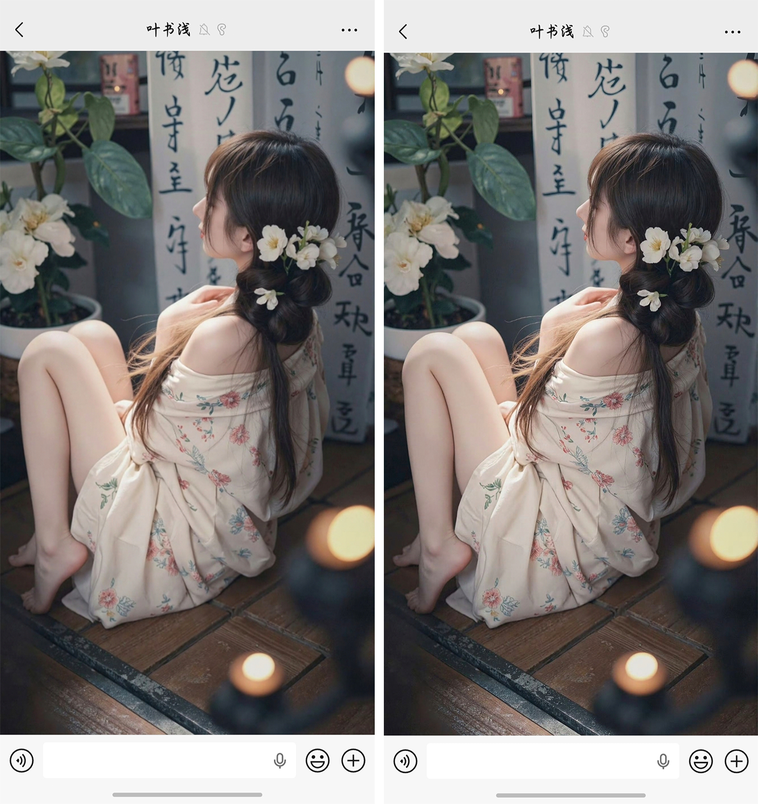
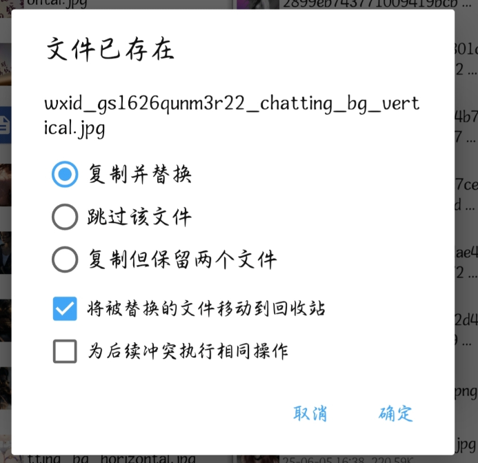

# 通过 MT 实现微信聊天背景原图无损替换

微信在设置聊天背景时，会对用户上传的图片进行二次压缩，导致高分辨率或纯色图片出现明显的噪点和模糊。通过直接替换微信本地缓存文件夹中的文件，我们可以绕过微信的压缩机制，实现真正的原图背景。

先上效果图

### 一、 准备工作

1. **安装 MT 管理器**：由于 Android 系统对 `Android/data` 目录的访问限制以及方便操作，建议使用 MT 管理器（或具备类似功能的权限绕过工具）。

2. **准备原图**：将你想要作为背景的高清图片保存到手机相册中。

### 二、 定位微信背景存放路径

微信的聊天背景存储在私有目录下，路径通常如下：

1. 打开 **MT 管理器**，左侧窗口进入： `/storage/emulated/0/Android/data/com.tencent.mm/MicroMsg/`
注意：是data不是.data
2. 在该目录下，寻找名称为 **32位字符（由数字和字母组成）** 的文件夹。

    - _注：如果你登录过多个账号，会有多个此类文件夹。请根据文件夹的修改日期或文件大小判断，通常体积最大的即为你当前主账号。_

3. 继续进入该文件夹下的 `package` 目录。

    - **完整路径示例**：`.../MicroMsg/bb5c2252.../package/`

4. 在该目录下，你可以看到一些 `.jpg` 文件。点击图片缩略图进行预览，确认哪一张是你当前正在使用的、需要被替换的背景图。

### 三、 在相册中定位原图

1. 在 **MT 管理器** 的右侧窗口，导航至你的相册存放目录。

    - **系统相机拍摄**：`/storage/emulated/0/DCIM/Camera/`

    - **第三方保存/截图**：`/storage/emulated/0/Pictures/` 或 `/DCIM/Screenshots/`
      系统相册中如果有分类那会更好找，比如我把它添加到了**壁纸**分类

可以点击MT管理器右上角进行排序

2. 找到你准备好的高清原图，这里我是右侧第一张。

### 四、 替换操作步骤

这是实现无损背景的核心步骤，本质是“同名文件覆盖”：

1. **获取目标文件名**： 在左侧微信 `package` 目录中，长按那个模糊的背景图，选择 **“重命名”**，将该文件的完整名称（包含后缀名）全选并 **复制**，随后取消重命名。

2. **重命名高清原图**： 在右侧相册目录中，长按你的高清原图，选择 **“重命名”**，删除原名，**粘贴**刚才复制的微信背景名。

3. **执行替换**： 长按右侧已改名的原图，选择 **“移动”**（或复制）到左侧的微信 `package` 目录。当系统提示“文件名重复”时，选择 **“覆盖”**。

---

### 五、 生效与校验

替换完成后，微信可能还没来得及更新背景图，因为旧的图片可能仍驻留在内存缓存中。可以退出重进。